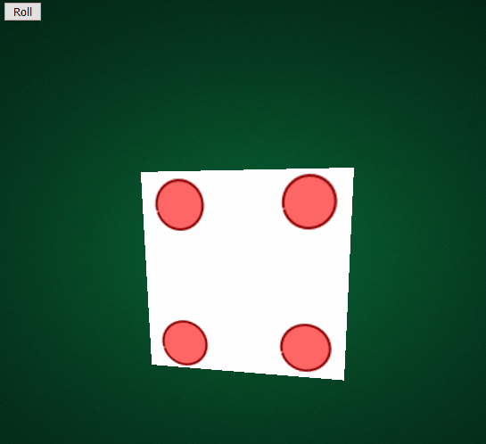

# Workshop on three.js : how to make a dice ?

## by Yannick Coopman, Jonathan Deschuyteneer, Olivia Fantinel

In this workshop, we have learned how to install and use three.js in about 3 hours ! 

Three.js is a powerful tool that makes use of WebGL to render 3D computer animations in HTML canvas and without much efforts. The source code can be found [here](https://github.com/mrdoob/three.js/).

You can see the result of our workshop by clicking on 


## How to install and use three.js on my web page ?

1. Begin your project in your localhost (to avoid CORS problems) by making those files inside your project folder :


2. Do the following commands in your project folder : `npm init` and `npm install three`. If done correctly, you should have a package.json and a package-lock.json files, as well as a node_modules folder.

3. Import three.js in you script using this line at the beginning of your Javascript file : 

```js
import * as THREE from "./node_modules/three/build/three.module.js";`.
```


## What did we do during this workshop ?

In short, we did this : 



How did we do this in 3 hours ?!

1. We installed three.js together to make sure everyone was starting from the same point and that it wouldn't be a problem later;

2. We did an Hello Cube : we created our first three.js scene, then we put a camera and a cube;

3. We learned how to animate this cube using `requestAnimationFrame`;

4. We played a little bit with our cube : we learned how to use AxesHelper, OrbitControls and how to map textures (in this case, the dice textures) to this cube;

5. We created a rollDice and stopDice function, and did a stopBuffer to prevent the dice from stopping halfway through two faces;

6. We answered to various questions and since we had a little bit of extra time, we did a little bonus and showed how to load 3D models.


## Thanks !

* Thanks to everyone who followed the workshop. I didn't think it would go so well, but everyone seemed to achieve the dice, you can all be proud of you !

* Thanks to the coaches at (BeCode)[https://becode.org/] for letting us present this workshop !

* From Olivia Fantinel : I couldn't thank enough (Joffrey Bienvenu)[https://joffreybvn.be/] who helped me a lot with three.js on (this previous project)[https://github.com/tanoshiibot/ImmoEliza], and to Yannick Coopman and Jonathan Deschuyteneer for presenting this workshop with me, I'm really glad I could work on a technology as fun and as interesting as three.js and I couldn't have withou you !


## Sources

* (threejs.org)[https://threejs.org/] - Official website, and the documentation.

* (threejsfundamentals)[https://threejsfundamentals.org/threejs/lessons/threejs-fundamentals.html] - Really nice tutorials about three.js.

* (three.js journey)[https://threejs-journey.xyz/] - Big course about three.js.

* (Élisée)[https://twitter.com/elisee] - A french game developer who is currently using three.js for his new project Sparks.land. Don't hesitate to follow him on (Twitch)[https://www.twitch.tv/eliseegw] where he streams himself while he codes the game.

* (KenShape)[https://kenney.itch.io/kenshape] - A little indie 3D modeling tool to make isometric 3D models from 2D pixel art that Olivia showed at the end of the workshop.

* (Blender)[https://www.blender.org/] - A free and open 3D modeling tool that is much more complete.


## The nice people who presented this workshop :

* Yannick Coopman => (Github)[https://github.com/Yaco-99] - (Linkedin)[https://www.linkedin.com/in/yannick-coopman/]

* Jonathan Deschuyteneer => (Github)[https://github.com/deschuyteneerj/] - (Linkedin)[https://www.linkedin.com/in/jonathan-deschuyteneer/] - (CV)[https://deschuyteneerj.github.io/Mon-CV/] 

* Olivia Fantinel => (Github)[https://github.com/tanoshiibot] - (Linkedin)[https://www.linkedin.com/in/olivia-fantinel/]

